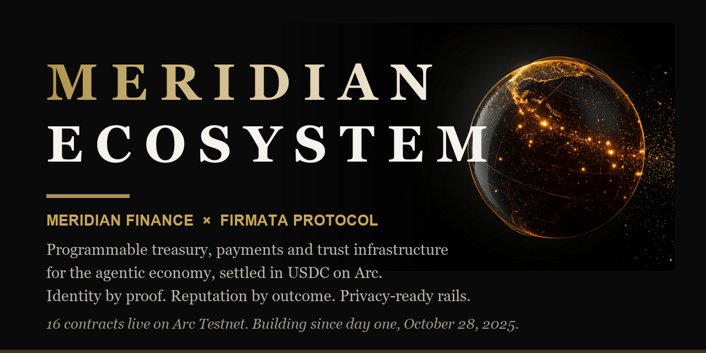
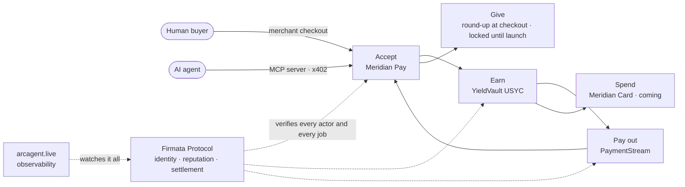
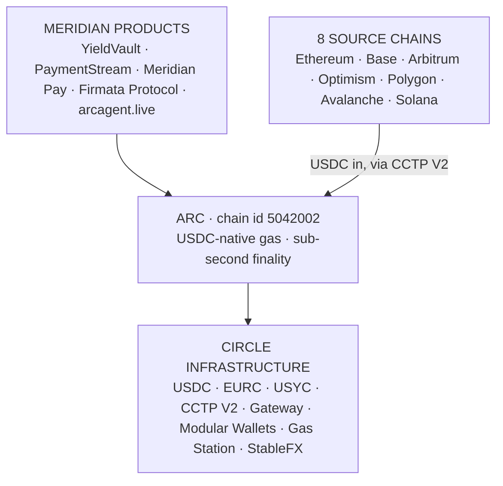

<div align="center">



<br/><br/>

[](https://testnet.arcscan.app)
[](https://testnet.arcscan.app)
[](#numbers-not-adjectives)

[](https://testnet.arcscan.app)
[](#numbers-not-adjectives)
[](#the-stack)
[](#standards-and-security-posture)

<br/>

**[themeridian.finance](https://themeridian.finance)** · **[firmata.ai](https://firmata.ai)** · **[arcagent.live](https://arcagent.live)** · **[X @Meridian_Fi](https://x.com/Meridian_Fi)** · **[X @FirmataProtocol](https://x.com/FirmataProtocol)**

</div>

---

```solidity
// SPDX-License-Identifier: MIT
pragma solidity ^0.8.24;

/// @title   Meridian Ecosystem
/// @author  Two brothers, building since day one of Arc Testnet
/// @notice  Programmable payments, treasury and trust for the agentic economy
/// @dev     16 contracts live · 452 tests passing · receipts over roadmaps
contract MeridianEcosystem is Payments, Treasury, Trust {
    // accept → manage → deploy → verify
}
```

**Programmable payments, treasury and trust infrastructure on [Arc](https://www.arc.io). Building since day one of Testnet, October 28, 2025.**

We build the financial layer that regulated businesses and autonomous agents can actually run on: yield-bearing treasury backed by tokenized T-bills, streaming payments, merchant settlement, and an onchain trust protocol for AI agents. Everything listed below is deployed on Arc Testnet (chain id 5042002) and verifiable on [arcscan](https://testnet.arcscan.app).

This repository is the public index of what we build and where it lives onchain. The product code sits in private repositories. If you are reviewing us for a partnership, an audit or an integration, ask for read-only access: open an issue here or DM [@Meridian_Fi](https://x.com/Meridian_Fi) with your GitHub handle.

## Why we build this

Stablecoin routing is solved. Sub-second settlement is solved. What is not solved is the layer on top: how does a regulated business run treasury and payroll on public rails, and who do you trust when the counterparty is an autonomous agent. Both questions have the same shape. Both need infrastructure, not promises.

We write about this in long form on the Arc Hub: *Routing solved. Trust didn't.* and *Private rails still need to know who they're paying.*

## One stack, not a product list

Every product below feeds the next one. A human pays at a merchant checkout; an AI agent pays through the same rails, machine to machine. At checkout, the buyer can round up and the spare cents go to a verified charity. The treasury earns on every dollar while it sits, payroll streams out of it continuously, and soon the card spends it directly. When the actors are autonomous agents, the trust layer verifies who they are and whether the work was actually done. One loop: **accept, manage, deploy, verify.**



For autonomous agents this loop has a name: **Meridian Agent OS**. Identity, Treasury, Payroll, Procurement, Reputation, Compliance. One agent address, one signature, the whole financial life of an agent in one place. A preview is live at [dev.themeridian.finance/erp-for-agents](https://dev.themeridian.finance/erp-for-agents).

### How it sits on Arc and Circle



Every product settles in USDC on Arc and is built on Circle primitives end to end. Nothing custodial sits in between.

## The stack

### Meridian YieldVault

Programmable yield on tokenized US T-bills (Hashnote USYC, the largest tokenized money market fund), built as an ERC-4626 vault. Two deployments: a retail vault, and an enterprise vault that serves as merchant treasury. Deposits earn while they sit, withdraw any time, governance actions go through a 24 hour timelock. Meridian is whitelisted on the USYC Teller, which is not a common thing to be able to write.

| Contract | Address (Arc Testnet) |
|---|---|
| YieldVault V3, retail proxy | `0x2f685b5Ef138Ac54F4CB1155A9C5922c5A58eD25` |
| Enterprise USYC Vault | `0xdae34fcc36d0772f6e04674971f798fa01bd0538` |
| USYCTimelock, 24h governance | `0x9f3856dF5CE0797aEe7FaE3E13794d4d52f9eB40` |

### Meridian PaymentStream

Continuous USDC streams for payroll, subscriptions and vendor payments. Money moves every block instead of every month. Cancel, top up or redirect a stream at any time.

| Contract | Address (Arc Testnet) |
|---|---|
| PaymentStream V3, proxy | `0x1fcb750413067Ba96Ea80B018b304226AB7365C6` |

### Meridian Pay

Checkout and merchant settlement on Arc, in private beta, with the Enterprise USYC Vault as the merchant treasury leg: a merchant accepts USDC at checkout and the balance starts earning the moment it settles. That is the accept-to-earn half of the loop above. Merchants can also switch on round-up donations at checkout, powered by Meridian Give. More on both when they ship publicly.

### Cross-chain and settlement plumbing

| Contract | Address (Arc Testnet) |
|---|---|
| GatewayReceiver, CCTP V2 + Circle Gateway | `0x8B412f7cAfA72482BE146268C4AD57231D8282cF` |
| x402 Receiver, HTTP-level nanopayments | `0x68ebe8f653f7a99cd8590f212818d2b60fdb3cac` |
| MeridianProof, cross-chain agent identity (SBT) | `0x7ED960c5437007C63Ea954BB01BBd36396F46490` |

### Firmata Protocol

**KYA: Know Your Agent.** The trust layer for autonomous agents, live since day one of Testnet. Identity by proof, reputation by outcome, settlement by verification. An agent gets a verifiable identity, builds reputation from attested results, and settles work through conditional escrow that only releases when the job checks out. Built on the ERC-8004 and ERC-8183 standards plus x402. The rest of the stack moves the money; Firmata decides who deserves to touch it.

ERC-8004 standard registries:

| Contract | Address (Arc Testnet) |
|---|---|
| IdentityRegistry | `0x8004A818BFB912233c491871b3d84c89A494BD9e` |
| ReputationRegistry | `0x8004B663056A597Dffe9eCcC1965A193B7388713` |
| ValidationRegistry | `0x8004Cb1BF31DAf7788923b405b754f57acEB4272` |

Firmata Protocol V2.3, canonical deployment:

| Contract | Address (Arc Testnet) |
|---|---|
| FirmataCommerce | `0xc91ab8c8c9d1879357e1c8cd60a936643f447417` |
| FirmataEvaluatorV2 | `0x0e55949531ba5bacbfa45c186cdcb9811d23c978` |
| FirmataSLAHook | `0x99c539ec88851980f05d42c90b18f122f1c01dad` |
| FirmataReputationV2 | `0xacb1f85bce0731d2bcb0e0788c88e45eba7a72ad` |
| FirmataSLA | `0x8b1fb35f25c799aa4dc8460f83b4b7a86f0f7854` |
| FirmataUsageLog | `0x4bf87626da383230eb663988e45975f3e9772003` |

### YieldClaw

The proof that the stack above is not theoretical: YieldClaw is a conversational shopping agent, registered as **ERC-8004 agent #262** on the IdentityRegistry above. It negotiates and buys from merchants in USDC on Arc, autonomously, no human signature, no card. Built during the OpenClaw hackathon, still running.

### arcagent.live

Observability for agent commerce on Arc: live view of agent transactions, reputation events and validation flows. The window into everything above, including YieldClaw at work. [arcagent.live](https://arcagent.live)

## Numbers, not adjectives

- **16 contracts** indexed here, **43+ smart contracts** total across four protocol repositories
- Building since **day one of Testnet: October 28, 2025**
- **47,800+ onchain transactions** across the stack
- **452 Foundry tests passing** across 23 test suites, fuzz tests included
- **20 Circle products** integrated in production: USDC native gas, EURC, USYC, CCTP V2, Gateway, Modular Wallets (passkey), Gas Station paymaster, StableFX and more
- USDC bridging into Arc from **8 source chains** (Ethereum, Base, Arbitrum, Optimism, Polygon, Avalanche, Solana and more) via CCTP V2
- **USYC Teller whitelist: granted**

All of it verifiable on [testnet.arcscan.app](https://testnet.arcscan.app). We prefer receipts to roadmaps.

## Standards and security posture

ERC-4626 (vaults), ERC-8004 (agent identity and reputation), ERC-8183 (commerce and conditional escrow), x402 (HTTP-level settlement), CCTP V2, Permit2, UUPS upgradeable proxies. Zero-custodial by design: we never hold user funds. Governance behind a 24 hour timelock, role-based access control on every privileged path, ReentrancyGuard and SafeERC20 on external calls, CI with secrets scanning on every repository. Audits are planned ahead of mainnet; until then, the test suites and the onchain history are the evidence.

## The websites, all of them

Every surface we run is listed below, open or not. A directory entry you cannot map to real surfaces is just a claim, so here is the full map.

One thing to know before you click: **several surfaces are deliberately locked right now.** We are in an active test and feature-update phase ahead of mainnet, and we lock pre-launch products on purpose rather than leave them open to scraping. If a link below greets you with an error page or a login wall, that is the lock working, not the product failing.

| Surface | Status | What it is |
|---|---|---|
| [themeridian.finance](https://themeridian.finance) | Live | The main product surface: vault, streams, dashboard. A major new version is in the works, with features we are keeping for the release. |
| [firmata.ai](https://firmata.ai) | Live | Firmata Protocol: the KYA thesis and the protocol surface. Dashboard is access-gated. |
| [arcagent.live](https://arcagent.live) | Live | Observability for agent commerce on Arc. Watch our agents transact, right now. |
| [themeridian.cards](https://www.themeridian.cards) | Live, landing | Meridian Card: spend the treasury directly in the real world. Contracts intentionally not deployed yet. |
| [docs.firmata.ai](https://docs.firmata.ai) | Locked, test phase | Protocol documentation, SLA schema, SDK guides. Locked while we update it. |
| [pay.themeridian.finance](https://pay.themeridian.finance) | Locked, private beta on testnet | Merchant checkout, dashboard, API. Locked during the beta, opens publicly when it ships. |
| test.pay.themeridian.finance | Locked, staging | Pre-production QA environment for Meridian Pay. |
| dev.themeridian.finance/erp-for-agents | Locked, preview | Meridian Agent OS cockpit: the six pillars rendered live for one agent address. |
| give.themeridian.finance | Locked until launch | Meridian Give: USDC charitable giving with merchant round-up at checkout. Returns 404 to unauthenticated visitors, by design. |

Reviewing us for Circle, Arc or a partnership and want to see behind a lock? Ask. We will create reviewer credentials tied to your email. You get the product, not the codebase.

## About the private code

We get asked why the source is private. Short answer: we are a small team in a fast market, pre-audit and pre-mainnet, and we would rather show working contracts onchain than hand out recipes. The addresses above are the proof of work. If you need to see the source for a serious reason, ask. Reviewers from Circle and partner institutions have been given read-only access before; we are easy about it when there is a name attached.

## What's next

Arc mainnet is around the corner. We were there on day one of Testnet. We will be there on day one of mainnet, with audits, a new themeridian.finance, and the same habit: ship first, talk after.

Also in the pipeline: **Meridian Pay** opens publicly, **Meridian Give** launches with it, and **Meridian Card** brings the treasury to the real world. No Card contracts are deployed yet, by design: the card rides on the rails above, and we do not announce architecture before it ships.

## Contact

**Aziz Moussaoui**, co-founder and CEO: aziz@themeridian.finance
Built with my brother **Fayssal Moussaoui**, co-founder and CTO. Two founders, one stack, day one of Testnet.

<div align="center">
<br/>

*Meridian Finance Group Ltd. Built on Arc.*

</div>
